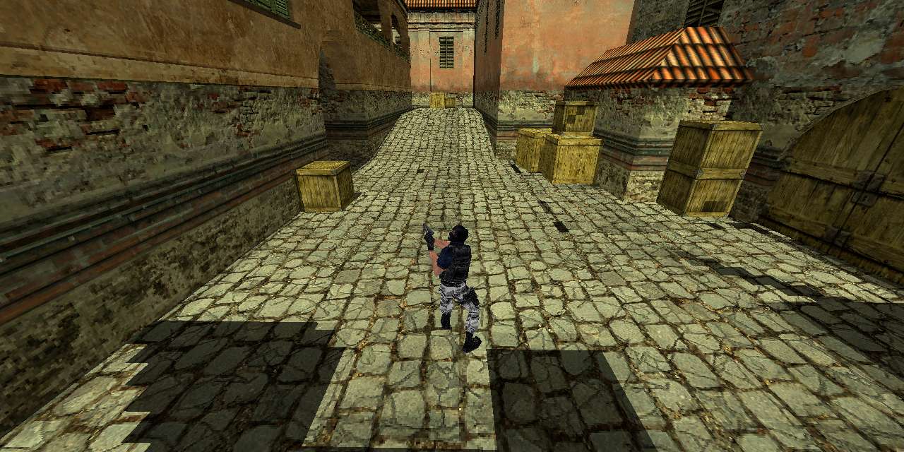
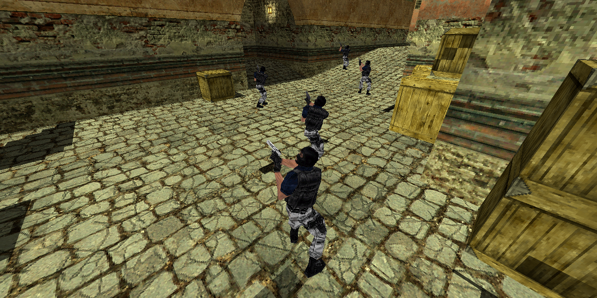
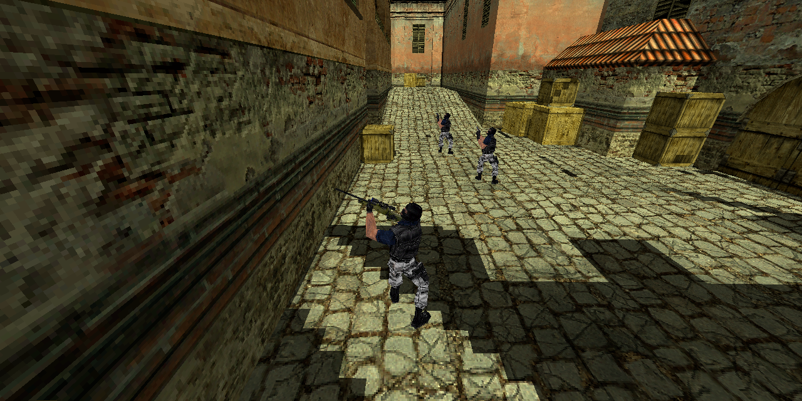
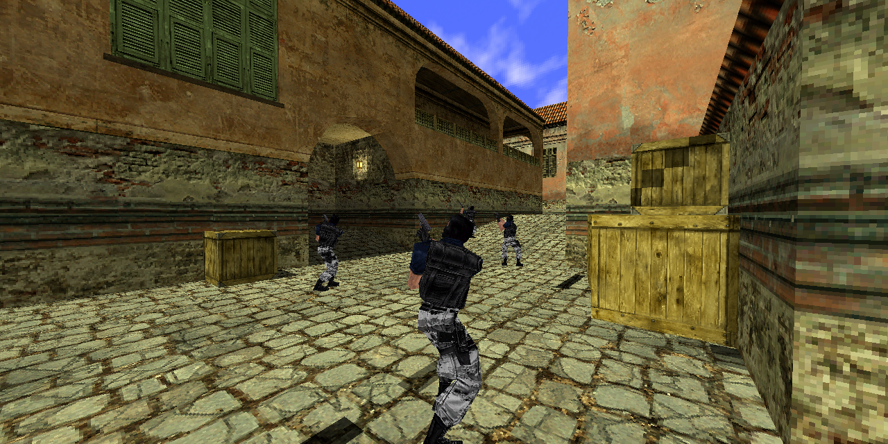

# CS Viewer

**Put a Counter-Strike 1.6 match on your website — playable back in third person, in the
browser.**

Drop a `.dem` recording in, get a real 3D replay out: the actual map, the actual player
models, and a camera that follows any player over the shoulder. No game install for the
viewer, no plugins, no video encoding, no server. It is one ES module and a `<div>`.



---

## What this is

Counter-Strike demos are not videos — they are a recording of the *network stream*, which
means a replay knows where every player stood, where they were looking, and what they were
doing, frame by frame. Normally the only way to watch one is to install the game and load
it in the engine, which puts it out of reach for a website.

CS Viewer decodes that stream in the browser and re-renders the match with WebGL. It is
built to be **embedded**: a match-history page, a tournament recap, a coaching write-up or
a clan site can host replays that visitors watch in-place, from any angle, on any device
with a browser.

<table>
  <tr>
    <td></td>
    <td></td>
  </tr>
  <tr>
    <td align="center"><em>Chase camera — orbit and zoom around any player</em></td>
    <td align="center"><em>It traces the map's collision hulls, so it stays out of walls</em></td>
  </tr>
  <tr>
    <td colspan="2"></td>
  </tr>
  <tr>
    <td colspan="2" align="center"><em>Press <code>2</code> to drop into that player's own eyes</em></td>
  </tr>
</table>

> These frames are produced by `npm run still`, which renders through the **same** camera
> rig, map geometry, lightmaps and studio skinning as the browser does — just into a PNG
> instead of a canvas. See [Verifying it without a GPU](#verifying-it-without-a-gpu).

| | |
|---|---|
| 🎥 **Third-person camera** | Chase camera behind any player, with mouse orbit and zoom, kept out of geometry by the engine's own hull tracing. |
| 👁 **Two more views** | First-person down the player's aim, and a detached free-fly camera. |
| 🗺 **The actual map** | The `.bsp` rendered with its own textures, **baked lightmaps** and skybox. |
| 🧍 **The actual player models** | Half-Life studio models, GPU-skinned: legs on the walk cycle, torso on the aiming animation, interpolated between keyframes. |
| 🔫 **The weapon they were holding** | The `p_*.mdl` bone-merged onto the player's arm, exactly as GoldSrc does it — so the gun tracks the hand through every reload. |
| ⏯ **Full transport** | Play/pause, scrub, 0.25×–8× speed, jump between players. |
| 📋 **Match context** | Roster by team, kill feed and round outcomes, recovered from the demo's own messages. |
| 🧩 **Embeddable** | One ES module, shadow-DOM isolated, with a small API. Drops onto any page. |

A 49 MB, 72-minute HLTV recording decodes in **~400 ms** on a laptop, off the main thread
in a Web Worker: 141,797 frames, 14 players, 662 kills, 54 rounds.

---

## Embedding it on your own site

### 1. Build the module

```bash
npm install
npm run build:lib     # -> dist-lib/cs-viewer.js  (one file, ~163 KB gzipped)
```

Everything is bundled in, including three.js and the demo decoder — no import map, no
peer dependencies, and the worker is inlined so the file also works when served from a
CDN on another origin.

### 2. Host the game assets

The viewer needs the map and player models. Extract them once (see
[Getting the game content](#getting-the-game-content)) and serve `public/assets/` from
anywhere — your own origin, a bucket, a CDN. Point `assets` at it.

### 3. Drop it on a page

Markup only — no JavaScript beyond one call:

```html
<div data-cs-viewer
     data-demo="/demos/match.dem"
     data-assets="/cs-assets"
     style="height: 540px"></div>

<script type="module">
  import { autoMount } from '/js/cs-viewer.js'
  autoMount()
</script>
```

Or drive it from your own code:

```js
import { createCsViewer } from '/js/cs-viewer.js'

const viewer = createCsViewer('#replay', {
  demo: '/demos/match.dem',
  assets: '/cs-assets',
  mode: 'third-person',
  autoplay: false
})

viewer.on('ready', (match) => {
  console.log(match.mapName, match.players)   // wire up your own scoreboard
})

// Link a replay to your own UI — jump to the moment of a kill, follow that player:
document.querySelector('#kill-42').onclick = () => {
  viewer.seek(1275)
  viewer.follow(7)
  viewer.play()
}
```

A runnable version of both is in [`examples/embed.html`](examples/embed.html)
(`npm run dev`, then open `/examples/embed.html`).

The widget renders into a **shadow root**, so your stylesheet cannot reach into it and its
styles cannot leak onto your page. The only thing it needs from you is a container with a
height.

### Options

| Option | Default | |
|---|---|---|
| `demo` | — | URL, `File`/`Blob`, or raw bytes. Omit and call `load()` later. |
| `assets` | `/assets` | Base URL serving `maps/`, `models/`, `env/`. |
| `autoplay` | `true` | Start playing once ready. |
| `mode` | `'third-person'` | Also `'eye'`, `'free'`. |
| `follow` | first player | Player slot to follow. |
| `startTime` | `0` | Seconds into the recording. |
| `speed` | `1` | Playback rate. |
| `brightness` | `1.1` | Map lighting multiplier. |
| `controls` | `true` | Built-in transport bar. |
| `roster` | `true` | Team roster and kill feed. |
| `nameTags` | `true` | Floating names above players. |
| `keyboard` | `true` | Keyboard shortcuts (only while hovered). |

### API

```ts
viewer.load(source)      // Promise<ReplaySummary>
viewer.play() / pause() / toggle()
viewer.seek(seconds)
viewer.setSpeed(rate)
viewer.setMode('third-person' | 'eye' | 'free')
viewer.setBrightness(value)
viewer.follow(slot)
viewer.players()         // [{ slot, name, team }]
viewer.currentTime / duration / isPlaying
viewer.destroy()

viewer.on('ready' | 'progress' | 'error' | 'timeupdate' | 'play' | 'pause' | 'followchange', fn)
```

Every `on()` call returns an unsubscribe function. TypeScript declarations ship in
`dist-lib/types/`.

---

## Quick start — watch the sample match

There is a real 72-minute match on `de_inferno` published with this repo, so you can see
it working before pointing it at anything of your own.

### 1. Get the code

```bash
git clone https://github.com/Elkhan-Isayev/cs-viewer.git
cd cs-viewer
npm install
```

You need **Node 20 or newer** (`node -v` to check).

### 2. Get the game content

The viewer draws the actual map and models, so it needs those files. They are Valve's, so
they are **not** in this repo — you supply them from your own copy of the game.

**If you have Counter-Strike 1.6 installed** (the usual case):

```bash
npm run assets -- --game "/path/to/Half-Life"
```

Point `--game` at the folder that *contains* a `cstrike` folder:

| OS | Path |
|---|---|
| Windows | `C:\Program Files (x86)\Steam\steamapps\common\Half-Life` |
| macOS | `~/Library/Application Support/Steam/steamapps/common/Half-Life` |
| Linux | `~/.steam/steam/steamapps/common/Half-Life` |

**If you don't have the game installed**, the sibling project
[cs16-web](https://github.com/Elkhan-Isayev/cs16-web) builds a `valve.zip` for you (it
downloads it from Valve's own anonymous SteamCMD servers). Then:

```bash
npm run assets -- --zip "/path/to/valve.zip"
```

Either way:

```
Maps:
  maps/de_inferno.bsp                               6123 KiB
    0 of its textures live outside the .bsp
    skybox "green": 6/6 faces
Per-map texture packs:
  de_inferno: fully self-contained, no texture pack needed
Wrote 50 files to public/assets/
```

That is ~27 MB, extracted once. It is deliberately frugal: most CS maps embed their own
textures in the `.bsp`, so the script checks what a map is actually missing and builds a
small per-map `.wad` for just those, rather than shipping `halflife.wad` (37 MB).

### 3. Get the sample demo

```bash
npm run sample
```

Downloads the example recording (49 MB) into `public/demos/demo.dem`. It is also on the
[releases page](https://github.com/Elkhan-Isayev/cs-viewer/releases) as
`de_inferno-sample.dem` if you would rather grab it by hand.

### 4. Start it

```bash
npm run dev
```

Open **http://localhost:5180**.

### 5. Watch

Click **“Play the bundled sample match”**. It decodes in well under a second and starts
from round one, following the first player in third person. Then:

- pick anyone from the **roster on the right** to follow them instead,
- **drag** to swing the camera around them, **scroll** to pull back or move in,
- press **`2`** for that player's own eyes, **`3`** to detach and fly with `WASD`,
- **drag the scrubber** to jump anywhere in the 72 minutes, or set `4×` and skim.

---

## Watching your own demos

**Record one in-game.** Open the console in CS 1.6:

```
record mymatch
```

Play, then type `stop`. The file lands in your `cstrike/` folder as `mymatch.dem`.
HLTV/GOTV recordings work too — the sample one is exactly that.

**Watch it.** Drag the `.dem` onto the page. No copying, no config.

**If it is on another map**, extract that map first, then reload and drop the file again:

```bash
npm run assets -- --game "/path/to/Half-Life" --map de_dust2
```

The viewer reads the map name out of the demo, so if it is missing you get a message
naming the exact command to run.

## Controls

| | |
|---|---|
| `Space` | play / pause |
| `←` `→` | ±5 seconds |
| `,` `.` | previous / next player |
| `1` `2` `3` | third person / player eyes / free camera |
| drag | orbit the camera (chase) or look around (free) |
| scroll | zoom the chase camera |
| `WASD` `Q` `E` `Shift` | fly, in free camera |

---

## How it works

### The demo container

A GoldSrc demo is a 544-byte header, a directory at the end of the file, and a stream of
frames. Netmsg frames carry a **464-byte** fixed block before their payload — `float
timestamp` + `ref_params_t` (232) + `usercmd_t` (52) + `movevars_t` (132) + `vec3 view`
(12) + `int viewmodel` (4) + seven netchan sequence ints (28).

Walking it is exact: on the sample recording the parser consumes all 141,797 frames and
lands precisely on the directory offset, with the type-1 frame count matching the
directory's own `70897`.

### The network stream

Inside each payload is a packed sequence of `[id][body]` messages with no length prefixes,
so **one mis-sized body desynchronises everything after it**. All 59 message types are
parsed or exactly skipped, including the bit-packed ones (`svc_packetentities`,
`svc_event`, `svc_resourcelist`) that switch into bit mode mid-message and round back up
to a byte boundary at the end.

Entity state is **delta-compressed against a layout the server itself describes** at
connect time via `svc_deltadescription`. Those descriptions are themselves delta-encoded,
bootstrapped from one hardcoded table. Decoding them recovers the real field names and bit
widths — `origin[0]` at 21 bits with divisor 128, `gaitsequence`, `blending[0]` — which is
what makes positions and animations readable at all.

### HLTV recordings

An HLTV proxy has no local client to describe, so it emits `svc_clientdata` as a **bare
marker with no body**. Parsing a normal client-data block there swallows the next message
and desyncs the packet. The viewer detects the stream kind from `svc_hltv` and frames the
message accordingly; POV demos still get the full parse.

(Consequence: HLTV demos also have an all-zero `democmdinfo`, so there is no recorded eye
position to borrow. Every camera here is reconstructed from entity deltas.)

### Rendering

- **Map** — BSP v30 faces grouped by texture into one batch each, with texture UVs from
  `texinfo` and a second UV set into a 2048² lightmap atlas (shelf-packed, borders bled
  outward so filtering cannot sample a neighbouring face). A small shader multiplies
  albedo by the lightmap with GoldSrc's overbright factor.
- **Sky** — the BSP's `sky*` faces are skipped, as the engine skips them; the map's six
  skybox images are loaded from `gfx/env` and drawn as a camera-locked cube instead.
- **Players** — studio models become `THREE.SkinnedMesh`. Studio vertices live in their
  own bone's local space, so the inverse bind matrices are identities; letting three.js
  derive them from the rest pose would apply the pose twice. Bone rotations use GoldSrc's
  `AngleQuaternion`, which is three.js's **`ZYX`** Euler order.
- **Animation** — the engine transmits `frame` as 0–255 across a sequence and splits the
  body: `gaitsequence` drives the legs, `sequence` the torso. That split is reproduced at
  the `Bip01 Spine` bone. The gait *phase* is not transmitted, so it comes from ground
  speed.
- **Camera collision** — the chase camera traces the map's clip hull with the engine's own
  `SV_RecursiveHullCheck` and pulls in when blocked.

### Coordinates

GoldSrc is Z-up, three.js is Y-up: `(x, y, z) → (x, z, -y)`, a −90° rotation about X that
preserves handedness. A Quake yaw of 0 faces +X, which is the default camera's −Z rotated
by `yaw − 90°`.

---

## Verifying it without a GPU

The whole rendering path runs from the command line, which is how it was built and how it
stays honest.

```bash
npm run check                              # parse map + every model, assert results
npm run inspect -- public/demos/demo.dem   # summarise a demo: players, kills, rounds
npm run still -- --time 2400               # render one frame to preview.png
```

`npm run still` drives the real camera rig, map geometry, lightmaps, skybox and studio
skinning, then rasterises through a small perspective-correct, near-plane-clipped,
z-buffered triangle filler in sRGB-correct linear space. It caught an inverted camera yaw
and a wrong Euler order — each looks fine to a type checker and obviously wrong in a
picture.

```bash
npm run still -- --time 2400 --mode third-person --player 7 --out shot.png
npm run still -- --time 2400 --mode free --pitch 55        # aim it anywhere
```

## Project layout

```
src/
  core/          BitReader (LSB-first, GoldSrc MSG_ReadBits) + ByteReader
  demo/
    container.ts header, directory, frame walking
    delta.ts     delta-description bootstrap + struct decoding
    messages.ts  all 59 svc_* messages
    replay.ts    delta stream -> per-player sample tracks, kills, rounds
    track.ts     flat typed-array sample storage
    worker.ts    decodes off the main thread
  bsp/           BSP v30 parse, miptex/WAD3, TGA, lightmap atlas, clip-hull tracing
  mdl/           studio model parse + skinning
  render/        camera rig, player actors, skybox, scene, coordinates
  embed/         the embeddable widget and its public API
  main.ts        the standalone page (a thin consumer of the widget)
examples/
  embed.html     both embedding styles, runnable
scripts/
  extract-assets.mjs  pull map/models from an install or valve.zip
  check-assets.mjs    headless pipeline assertions
  parse-demo.mjs      CLI demo summary
  render-preview.mjs  software renderer
```

## Troubleshooting

**“Map … is not in public/assets/maps”** — that map has not been extracted. Run the
`npm run assets` command from the message.

**`npm run assets` cannot find game content** — pass `--game` (an installed
Counter-Strike, the folder containing `cstrike`) or `--zip` (a `valve.zip`).

**The embed is blank** — the container needs a height; the widget fills its host element.

**Players show as coloured capsules** — a model failed to load. Re-run `npm run assets`;
the console names the missing file.

**Sky is a flat colour** — the skybox images were not extracted. Re-run `npm run assets`,
which now pulls `gfx/env/<skyname>*` alongside the map.

## Limits

- **No audio at all.** Nothing is played: no gunfire, footsteps or radio. Gunfire is the
  awkward one — CS fires weapons through HL *events* (`events/ak47.sc`) that the client
  turns into a sound locally, so a demo carries the event index and not the `.wav`. Wiring
  it up means mapping the precached event list onto sound names by hand, then extracting
  `cstrike/sound/` and playing it back positionally. `readSound` in
  `src/demo/messages.ts` currently walks `svc_sound` and discards it.
- **No muzzle flashes, grenades or bomb entities.** Non-player entities are decoded but
  not sampled or drawn — `recordSample` in `src/demo/replay.ts` is the place to extend.
  Weapon *models* are drawn; only the effects around them are missing.
- **Only demo protocol 5 / network protocol 48** — CS 1.6 and Half-Life era GoldSrc.
  CS:GO and CS2 demos are a completely different (protobuf) format.
- Round markers come from `TextMsg` tokens, so they reflect what the server broadcast;
  scores are not reconstructed.

## Credits

- **Counter-Strike** and **Half-Life** — game, maps, models and all related assets are
  © **Valve Corporation**. This project is not affiliated with or endorsed by Valve and
  ships no Valve content; `npm run assets` reads from a copy you already have.
- Demo/network format work was cross-checked against
  **[hlviewer.js](https://github.com/skyrim/hlviewer.js)** by Stefan Stojkovic (MIT),
  invaluable for confirming the entity-delta bit layout.
- Sibling project **[cs16-web](https://github.com/Elkhan-Isayev/cs16-web)** runs the same
  game playably in a browser via Xash3D FWGS, and can build the `valve.zip` this reads.

## Disclaimer

Provided **“as is”, without warranty of any kind**. An unofficial, hobby/educational tool
for reviewing recordings. You are responsible for ensuring your use complies with Valve's
EULA and any applicable law. If you host replays publicly, note that the game assets they
need remain Valve's — serve them accordingly.

MIT licensed — see [LICENSE](LICENSE).
